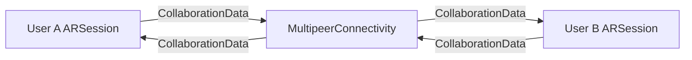
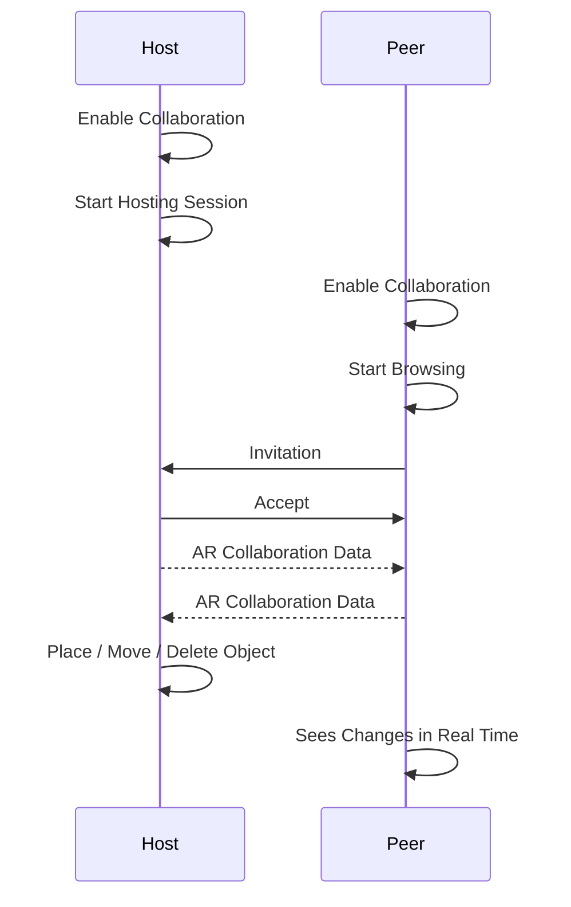
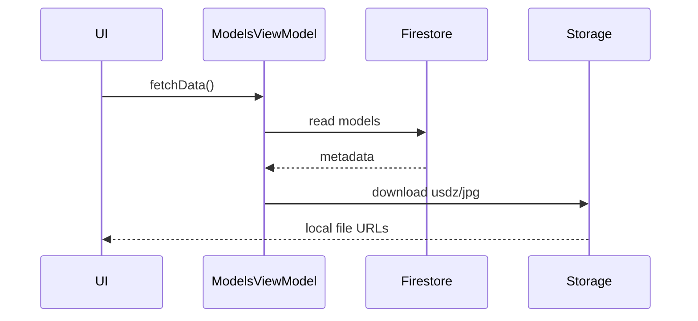
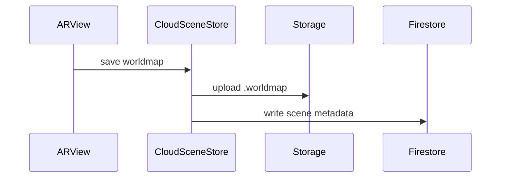
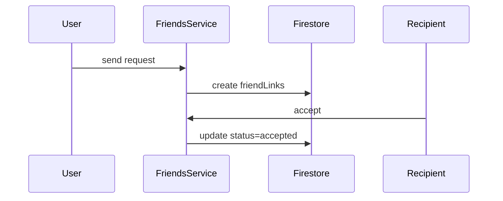

# Artifacts — Social Augmented Reality App

Artifacts is a SwiftUI + ARKit application that allows users to place, view, and share persistent digital objects (“artifacts”) in real-world locations. The app combines AR scene persistence, social connections, and cloud-backed storage using Firebase.

This repository documents both the **implementation** and the **system architecture**, with diagrams and explanations intended for onboarding, maintenance, and portfolio review.

---
## Pictures
### Login View


### Profile View


### Settings View


### AR Objects (Artifact) Browse View


### 3D Chameleon Artifact


### 2D Annotation Artifact


### Drawing Artifact


--

## Core Features

- Place and view 3D AR artifacts using ARKit & RealityKit
- Persistent AR scenes using ARWorldMap
- Social graph with friend requests and shared visibility
- Cloud-backed 3D model catalog
- Firebase Authentication, Firestore, and Storage integration
- Uses ARWorldTrackingConfiguration.isCollaborationEnabled = true
- ARKit automatically generates and consumes ARSession.CollaborationData
- Synchronizes:
  - World mapping
  - Anchors
  - Coordinate alignment

---

## High-Level Architecture

Artifacts follows a **SwiftUI + MVVM** architecture with explicit AR session management.

```

┌──────────────────────────┐
│        SwiftUI Views     │  ← UI & user interaction
└────────────▲─────────────┘
             │
┌────────────┴─────────────┐
│        ViewModels        │  ← App state & logic
└────────────▲─────────────┘
             │
┌────────────┴─────────────┐
│   AR / Scene Management  │  ← RealityKit & persistence
└────────────▲─────────────┘
             │
┌────────────┴─────────────┐
│ Firebase (Auth/DB/Store) │  ← Cloud persistence & security
└──────────────────────────┘

```

---

## Project Structure

```

Artifacts/
├── ArtifactsApp.swift        # App entry point
├── RootTabView.swift         # Main navigation spine
│
├── UIViews/                  # SwiftUI screens
│   ├── HomeARView.swift
│   ├── FullMapView.swift
│   ├── ProfileView.swift
│   ├── QuickProfileView.swift
│   └── FriendsListSheet.swift
│
├── ViewModels/               # State & logic (MVVM)
│   ├── ModelsViewModel.swift
│   ├── PlacementSettings.swift
│   ├── SessionSettings.swift
│   └── ModelDeletionManager.swift
│
├── ScenePersistenceHelper.swift
├── CloudSceneStore.swift
├── FirebaseStorageHelper.swift
│
└── Utilities/
└── Extensions.swift

````

---

## File & Component Responsibilities

### App Entry & Navigation

#### `ArtifactsApp.swift`
- App bootstrap
- Initializes SwiftUI environment
- Configures Firebase

#### `RootTabView.swift`
- Main navigation hub
- Defines app sections (AR, Map, Profile)
- Injects shared ViewModels via `@EnvironmentObject`

---

### SwiftUI Views (`UIViews/`)

SwiftUI views are **presentation-only**:
- Render UI
- Forward user input
- Observe ViewModel state

| File | Responsibility |
|----|----|
| `HomeARView.swift` | Main AR camera & placement UI |
| `FullMapView.swift` | Map-based artifact browsing |
| `ProfileView.swift` | User profile & settings |
| `QuickProfileView.swift` | Lightweight user preview |
| `FriendsListSheet.swift` | Friend requests & social UI |

---

### ViewModels (`ViewModels/`)

ViewModels are the **source of truth**.

#### `ModelsViewModel.swift`
- Manages loaded 3D models
- Handles AR anchor creation/removal
- Feeds artifact data to UI

#### `PlacementSettings.swift`
- Controls AR placement mode
- Tracks selected model
- Prevents conflicting interactions

#### `SessionSettings.swift`
- Global app/session state

#### `ModelDeletionManager.swift`
- Encapsulates deletion logic
- Coordinates safe removal of AR entities

---

### AR & Persistence

#### `CloudSceneStore.swift`
- Uploads and downloads ARWorldMap data
- Writes scene metadata to Firestore
- Bridges ARKit ↔ Firebase Storage

#### `ScenePersistenceHelper.swift`
- Applies saved ARWorldMaps to ARSession
- Restores scenes on launch

---

### MultipeerConnectivity (Peer-To-Peer Transport)
- Handles peer discovery and networking
- Sends collaboration packets between nearby devices
- No central server required
- Low latency and ideal for demos
- Used only as a transport layer — it does not interpret AR data.
#### CollaborationManager
- Bridges ARKit and MultipeerConnectivity
- Responsibilities:
  - Send outgoing collaboration data
  - Receive incoming collaboration data
  -   Apply updates to the ARSession

#### Collaboration Data Flow


### Session Lifecycle

#### CollaborationManager.swift

- Serializes and deserializes ARSession.CollaborationData

- Interfaces with MultipeerSession

#### MultipeerSession.swift

- Handles peer discovery

- Manages peer connections

- Sends raw Data between peers

---


### Utilities

#### `FirebaseStorageHelper.swift`
- Centralized Storage downloads
- Handles `.usdz` models and thumbnails

#### `Extensions.swift`
- Shared Swift & SwiftUI helpers

---

## Firebase Architecture

### Authentication
- Firebase Auth is required for nearly all reads/writes
- `request.auth.uid` is the primary identity

---

### Firestore Data Model

```mermaid
erDiagram
  USERS {
    string uid PK
    string email
    string username
    boolean isAdmin
  }

  MODELS {
    string id PK
    string name
    string category
    number scaleCompensation
  }

  SCENES {
    string sceneId PK
    string ownerUid FK
    string storagePath
    timestamp updatedAt
  }

  FRIENDLINKS {
    string pairId PK
    array participants
    string requesterUid
    string recipientUid
    string status
  }

  USERS ||--o{ SCENES : owns
  USERS ||--o{ FRIENDLINKS : participates
````

---

### Firebase Storage Layout

```mermaid
flowchart LR
  ST[(Firebase Storage)]

  ST --> M["models/*.usdz"]
  ST --> T["thumbnails/*.jpg"]
  ST --> U["users/uid/"]

  U --> SC["scenes/sceneId.worldmap"]
  U --> PP["profilePicture.jpg"]

```

---

## Core Call Flows

### Load 3D Model Catalog



---

### Save AR Scene



---

### Friend Request Lifecycle



---

## Security Model (Summary)

* **Models & thumbnails:** read-only for authenticated users
* **Scenes:** readable by owner or friends; write only by owner
* **Users:** public read; self/admin write
* **Friend links:** readable/updatable only by participants

Firestore rules enforce social visibility (`areFriends`) and ownership.


